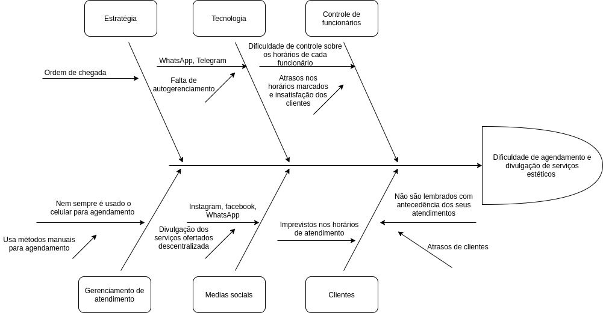

# 
 Diagrama causa efeito
## Histórico de versão

|Data | Versão | Descrição | Autor(es)
| -- | -- | -- | -- |
| 12.02.2021 | 0.1 | Criação do documento | Geraldo Victor|
| 13.02.2021 | 0.2 | Adição de metodologia, participantes, resultado, conclusão e referências | Geraldo Victor|

## Metodologia

O Diagrama de Ishikawa , também conhecido como "Diagrama de Causa e Efeito" ou "Espinha-de-peixe", é utilizado pela administração para o gerenciamento e controle de qualidade sendo uma ferramenta gráfica que auxilia em diversos processos. Os diagramas de Ishikawa são ferramentas sistemáticas muito úteis para encontrar, classificar e documentar as causas da variação da qualidade em uma determinada produção e organizar a mútua relação entre elas.

Para construção do diagrama de causa e efeito foram definidos os problemas e suas possíveis causas, para o escopo do projeto foram escolhidas 6 categorias das possíveis causas, sendo elas as seguintes: 

- Estratégias: quais são as estratégias adotadas atualmente pelos salões de beleza;
- Tecnologia: que tipo de tecnologias são utilizadas pelos salões de beleza para agendamento de atendimento;
- Controle de funcionários: como os salões de beleza controlam os horários de seus funcionários;
- Gerenciamento de atendimento: os métodos de gerenciamento mais utilizados pelos funcionários;
- Medias sociais: por onde é feita a divulgação dos serviços prestados por aquele salão; 
- Clientes: como os clientes são afetados pela forma de atendimento manual ou pelo telefone. 

Dessa forma foi possível fazer uma dedução mais objetiva das possíveis causas e montar uma estratégia para resolver os problemas levantados.
### Participantes

* Geraldo Victor 

### Resultado

Após a confecção do diagrama foi possível notar que para cada uma das seguintes categorias foram identificadas as seguintes causas que afetam direta ou indiretamente os problemas levantados:

- Estratégias: a estratégia utilizada pela maioria dos salões é pela ordem de chegada, o que pode causar certa dificuldade, uma vez que o cliente pode não ter tempo pra ir ao salão para marcar. Até mesmo pelo telefone a diferença do tempo em que o cliente manda mensagem até ser respondido pode significar a perda da vaga de atendimento no horário desejado.
- Tecnologia: WhatsApp e Telegram são usados para o agendamento, porém, não possuem autogerenciamento. Por exemplo, um cliente não consegue saber quais dias já possuem atendimentos agendados para outras pessoas;
- Controle de funcionários: muitas vezes os donos dos salões não conseguem gerenciar de maneira efetiva todos os seus funcionários, dessa forma atrasos decorrentes dessa falta de controle podem ser bem prejudiciais, uma vez que o cliente se programa para ser atendido;
- Gerenciamento de atendimento: Nem todos os salões usam o celular para agendar, dessa forma, há um gasto maior de tempo devido ao deslocamento que precisa ser feito até o local ou até mesmo gasto de tempo de ligação a fim de conhecer as possibilidades de atendimento em determinado horário e dia. Apesar de alguns salões estarem adotando o uso do celular devido a pandemia, ainda assim, muitos outros continuam utilizando agendas físicas, o que pode causar erros e falhas por falta de atenção ou descuido na hora de preencher a agenda;
- Medias sociais: com a variedade de redes sociais, muitas vezes é desgastante ter que publicar todos os serviços oferecidos pelos salão, sendo assim a ausência de um ambiente único de publicação dos serviços é um fator dificultante; 
- Clientes: com imprevistos cotidianos que levam a impossibilidade de prosseguir com o que foi agendado, os clientes tendem a esquecer de avisar a ausência ou simplesmente não comparecem ao estabelecimento. Além disso, nem todos os salões conseguem organizar-se de tal maneira que consigam avisar com atencedência aos seus clientes o atendimento marcado. 

### Conclusão

Através do uso do diagrama de causa e efeito foi possível ter uma visão maior sobre as causas dos problemas que nossa aplicação deve ser capaz de resolver, dessa forma, devemos levantar requisitos que sejam capazes de ser a solução para cada uma das causas identificadas.

## Referências

ISHIKAWA, Kaoru. **Controle de Qualidade Total**. 6. ed. Rio de Janeiro, Campus Editora, 1998.
