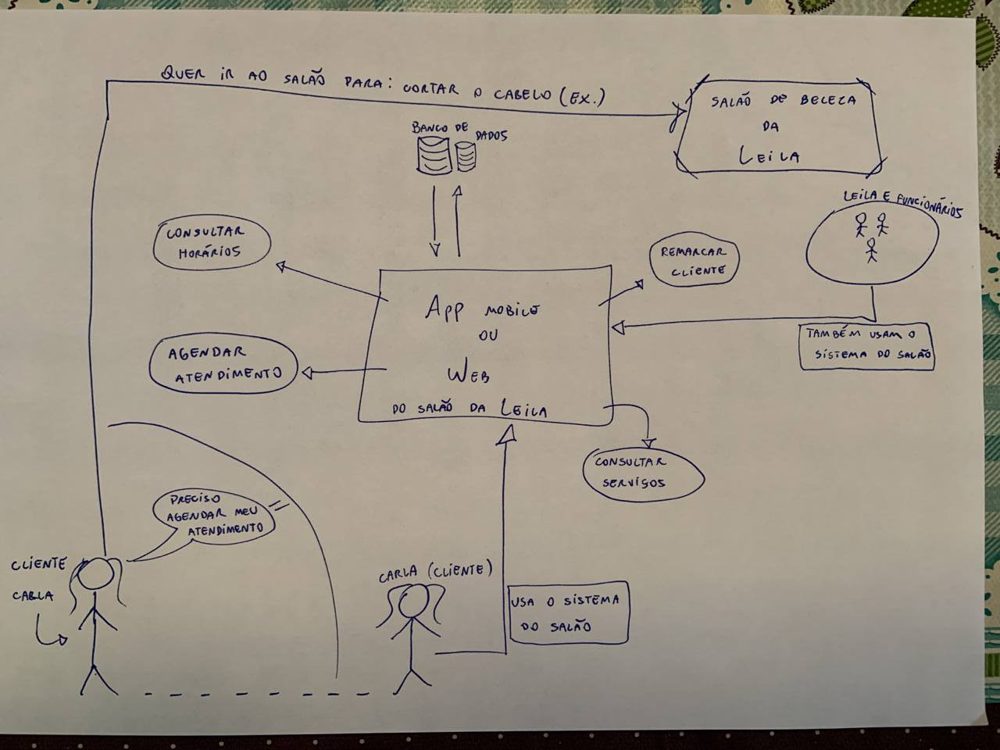
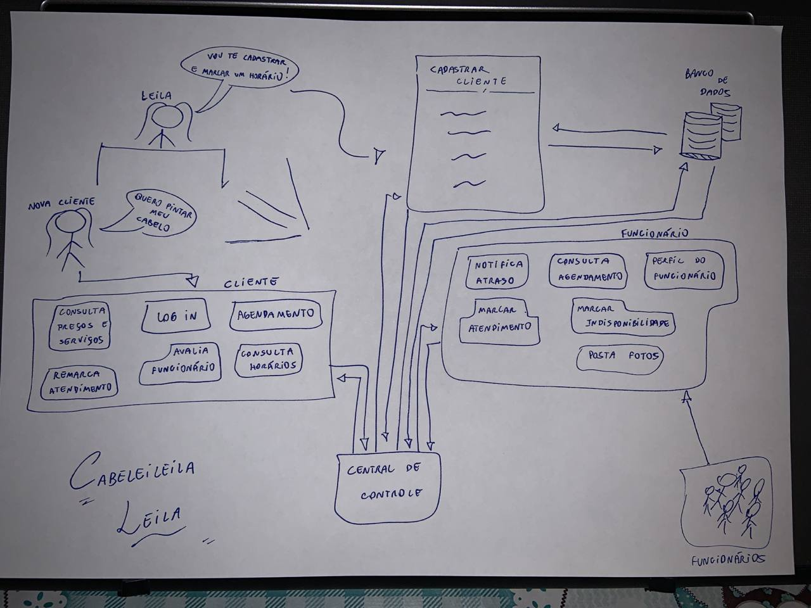
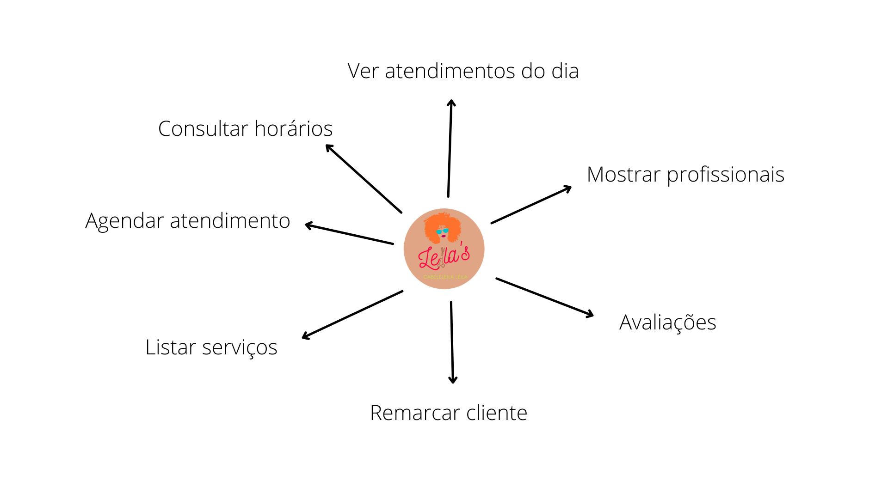
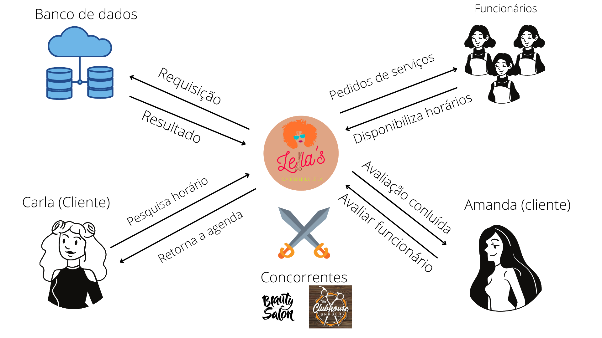

# 
 Rich Picture
## Histórico de versão

|Data | Versão | Descrição | Autor(es)
| -- | -- | -- | -- |
| 10.02.2021 | 0.1 | Criação do documento | Erick Giffoni|
| 10.02.2021 | 0.2 | Adição inicial dos Rich Pictures 1 e 2| Erick Giffoni|
| 10.02.2021 | 1.0 | Rotaciona o Rich Picture 1 | Erick Giffoni|
| 12.02.2021 | 1.5 | Adição das descrições dos Rich Pictures 1 e 2| Erick Giffoni|
| 12.02.2021 | 2.0 | Adiciona hyperlinks para os Rich Pictures 1 e 2 e corrige o texto em Resultados| Erick Giffoni|
| 13.02.2021 | 2.5 | Adiciona Rich Picture 3| Erick Giffoni e Damarcones Porto|
| 13.02.2021 | 3.0 | Adiciona hyperlinks das imagens do Rich Picture 3| Erick Giffoni|

### Participantes

* Erick Giffoni
* Damarcones Porto
* Isabella Carneiro (Revisão)

## Metodologia
  
Rich Pictures são artefatos que podem ser utilizados logo no começo do processo de elicitação. 
Trata-se de um artefato que não precisa ter orientação metodológica específica para usá-lo. 

O Rich Picture ajuda a entender melhor o contexto de uso de uma aplicação, por exemplo,  
porque ele consegue ilustrar graficamente uma situação para a qual pretende-se construir um  
software.

## Resultado

> Do que se trata esse Rich Picture ?

A ideia é representar o contexto diário do salão da cabeleireira Leila, bem como o *modus operandi* 
por meio do qual ela recebe clientes e fornece serviços.

Já sabemos de algumas dificuldades que a Leila tem no dia-a-dia dela no estabelecimento, 
e isso pode ser visualizado no [diagrama de causa e efeito](./causa-efeito.md).

Assim, a primeira versão do Rich Picture para o Salão da Cabeleleila Leila propõe uma 
abordagem simples para resolver aqueles problemas. Vide abaixo :

<a href="https://unbbr-my.sharepoint.com/:i:/g/personal/160010900_aluno_unb_br/EYMTM7Rw6YRJlJsoqjDfc-EBiFaI45dA3va4I9hEJOP22A?e=ylhkQ0">
> Rich Picture - v1.0 

</a>

Nessa primeira versão, temos ilustrada uma situação em que uma cliente pretende cortar o 
cabelo no salão da Leila. Para isso, ela recorre à aplicação web do estabelecimento, a 
qual tem diversas funcionalidades, como, por exemplo, agendar um atendimento.

Vale ressaltar que não só a cliente, mas também a Leila e os funcionários dela usam a 
aplicação, sendo que esta troca informações constantemente com um banco de dados.

Nossa equipe, responsável por tornar a demanda de um sistema para o salão da Leila 
realidade, realizou um [brainstorm](./brainstorming.md) inicial e, a partir dele, conseguiu elicitar alguns 
requisitos para o sistema em questão.

A partir disso, um novo Rich Picture foi feito, o qual trás mais algumas informações sobre 
aquele universo do estabelecimento da Leila. Vide abaixo :

<a href="https://unbbr-my.sharepoint.com/:i:/g/personal/160010900_aluno_unb_br/ETYj5DE7jzpJlYqTOEbvFr4BKU6EAvdXZfw3sGmuQhKtvA?e=WBVqt2">
> Rich Picture - v2.0 

</a>

Essa segunda versão do Rich Picture ilustra uma nova cliente que deseja um serviço oferecido 
pelo estabelecimento. Leila, então, utiliza do sistema para cadastrar a nova cliente. Esta, 
assim, já pode usufruir da aplicação para conseguir o que deseja.

O Salão da Cabeleleila Leila continua comunicando-se com um banco de dados; os funcionários 
permanecem utilizando esse sistema; e houve uma adição do que pode ser uma central de controle 
do sistema, responsável por verificar, por exemplo, qual o tipo de requisição está sendo feita 
(ex.: uma cliente tentando agendar um horário para pintar o cabelo, ou um funcionário que vai 
notificar um atraso).

Uma terceira versão do Rich Picture foi feita, inspirando-se nos artefatos anteriormente mencionados, 
bem como no [mapa mental](./mapa-mental.md) e na [identidade visual](./identidade-visual.md) para o Salão da Leila. Dessa vez, a ferramenta *Canva* foi utilizada 
para trazer uma abordagem simples, limpa e visualmente agradável de situações cotidianas no estabelecimento.

Obs.: vide abaixo o Rich Picture versão 3, composto por duas imagens.

<a>
> Rich Picture - v3.0 
</a>

A primeira imagem representa o sistema do salão como um todo e mostra, de forma resumida, 
as funcionalidades existentes. Vide abaixo :

   <a href="https://unbbr-my.sharepoint.com/:i:/g/personal/160010900_aluno_unb_br/EXw5kasdmNtEnWhYELUQDM4BEoYjn-RDJEgJnvwYNcZSJw?e=tAClJU">
   > Rich Picture - v3.0 - Imagem 1
      
   </a>

Já a segunda imagem representa uma situação em que duas clientes e alguns funcionários interagem 
com o sistema simultaneamente, e este os atende enquanto troca informações com o banco de dados. 
Vide abaixo :

   <a href="https://unbbr-my.sharepoint.com/:i:/g/personal/160010900_aluno_unb_br/EU2Z9omw8hJPid13IsJ-JQUBtNuNh26yoagdt2ApheVs2A?e=NMt1fF">
   > Rich Picture - v3.0 - Imagem 2
      
   </a>

Mais ainda, essa terceira versão demonstra algumas aplicações concorrentes ao sistema do Salão da Leila.

## Referências

Livro: SOMMERVILLE, Ian. **Engenharia de Software**. 9a edição, São Paulo: Pearson, 2011.

Livro: BARBOSA, S. D. J.; SILVA, B. S. **Interação Humano-Computador**. 1a edição, Rio de Janeiro: Elsevier, 2010.

SERRANO, Milene. **Base - RichPicture**, 2021. Material apresentado na Disciplina de Arquitetura de Desenho de Software do curso de engenharia de software da UnB, FGA. Acesso em: 10 de fevereiro de 2021

**Canva**. Disponível em : [canva.com](https://www.canva.com/en_gb/) .
